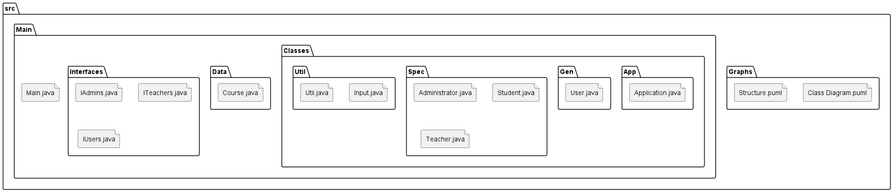
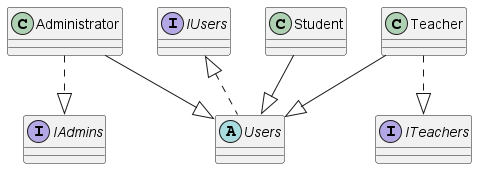

# CourseManagementSystem

## Description
A 🎮💻 application that somewhat simulates a course management system. It has a few basic features, such as adding students, teachers, courses, assigning teachers to courses, and allowing them to add students and assignments to their courses.

## Idea
While I've Probably 👁️ Learned More About The Structures And Workings Of C#, I Still Have A Lot To Learn About Java. This Project Is A Simple Console Application That I've Created To Practice Some Of The Things I've Learned So Far. So In Order To Challenge Myself, I've Decided To Create A Simple Management System For A Course. I Did Get Several Headaches Due To Me Planning Everything In My Head And Not On Paper. I've Also Learned That I Need To Better Plan A Structure Because I've Created The Methods In A Functional Way First And Optimized Them Later Based On DRY, Which Worked But It Could've Been Faster If I'd Single Out The Similar Functionalities First.

## How To Use

- First, You'll Have To Create An Admin Account.
-       This Account Will Be Used To Create Other Accounts And Courses.

- Then I'd Suggest Creating A Teacher Account.
-       You Won't Be Able To Create A Course If No Teachers Exist.

- After That, You Can Create A Course.
-       You'll Have To Assign A Teacher To The Course.

- Then You Can Create A Student Account.
-       You'll Have To Assign A Course To The Student, Which Can Only Be Done As A Teacher.

- Then You Can Create An Assignment.
-       Creating Or Removing An Assignment Is Also Something Only A Teacher Can Do.

## Functions

### 1. User / Student Functions

- **Show / Change Account Information**: View and edit your personal account information.
- **Show Course Assignments**: Display a list of assignments for the courses you are enrolled in.
- **Show Course Members**: Display a list of fellow students and the teacher in the courses you are enrolled in.

### 2. Teacher Functions

- **Same As User**
- **Create Exercise**: Add a new assignment to a specific course.
- **Delete Exercise**: Remove an existing assignment from a specific course.
- **Add Student**: Enroll a student in a specific course.
- **Remove Student**: Remove a student from a specific course.

### 3. Admin Functions

- **Same As User**
- **Show All Courses**: Display a list of all the courses available in the system.
- **Show All Users**: Display a list of all users, including teachers and students.
- **Create Account**: Create a new account for a teacher or a student.
- **Delete Account**: Remove an existing teacher or student account from the system.
- **Create Course**: Add a new course to the system.
- **Delete Course**: Remove an existing course from the system.

## Note

- An Admin Account Is Able To See The Username And Password Of Other Accounts
- There Cannot Be Duplicate Usernames
- There Cannot Be Duplicate E-Mails
- There Cannot Be Duplicate Course Assignments
- There Cannot Be Duplicate Students In A Course

## Diagrams
### General Structure

### Basic Relationships

### Class Diagram

